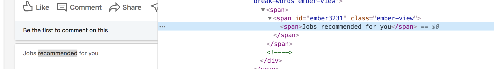
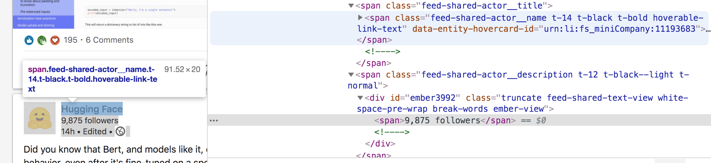
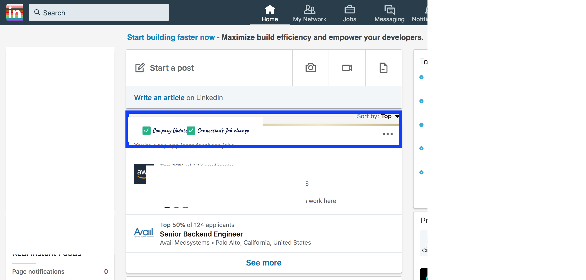

Feature 1 
====

Identify the different types of element in the feed.

***Job recommendation looks like this***

***A company div looks like this. Notice the html element on the right I've tried to capture so you can use to detect different types of divs***

All the different types of div the extension should be able to detect.
I will expect the code to have comments and showcase clearly the detection logic for each type of div.

Feature 2
====
Create a set of check boxes at the top of the feed  (see the blue box in the image below) and include the different div types. 
Include another div type that says 'All' which will restore all the divs if this is selected.

